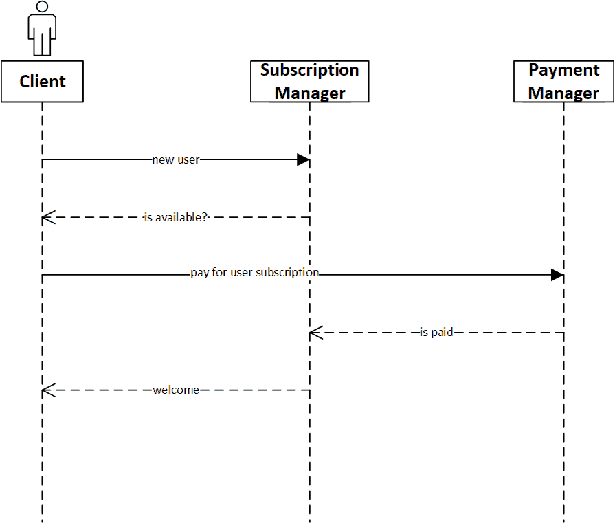

# Toth-cms
MVP: A drip feed subscription with paypal

## Features
### Must Have
- Users can subscribe by creating a username and password, and paying
- Users can log in using their username and password (after paying at least once)
- Admin can create content and publish it with a set delay
- The content is available for the subscriber after the set delay (x days/weeks/months/years after the subscription)
- Content is protected, only subscribers have access to it
- Front-end and back-end decoupled to allow make it easy to have different front-ends (Mobile, Web, Desktop, etc.)

### Should Have
- If a subscriber stops paying (cancel subscription), he can access the content he already paid for, but he receives no new content
- If a subscriber resumes his subscription, he starts receiving content starting from where he left off
- The price of the subscription remains the same unless you cancel your subscription (you can renew at the new price and hold that one)
- Track your progress

### Could Have
- Multiple subscriptions with different content
- Signing the content to tie it to a subscriber to track in case of sharing

## First version technical specifications
- Back-end in Golang
- The first version of the front-end (React) will be included in another repository

### User subscription happy path
